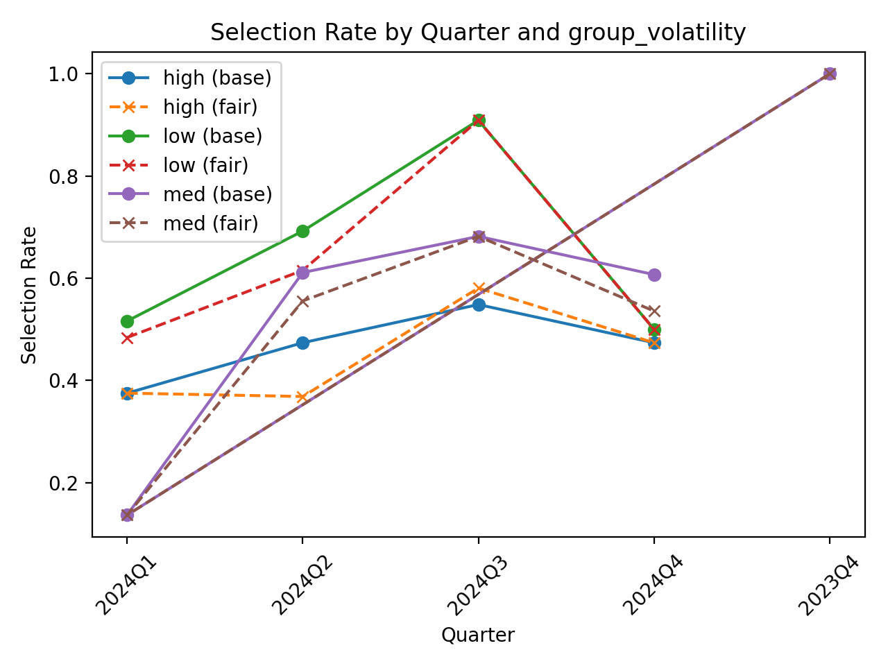

# Fairness-Aware Explainable AI for Responsible Algorithmic Trading


Repository accompanying the Springer *Digital Finance* submission:

**“Fairness-Aware Explainable AI for Responsible Algorithmic Trading”**

---

## Project Overview

This repository provides an end-to-end experimental pipeline for fairness-aware binary classification of next-day S&P 500 direction, combining predictive modeling, fairness mitigation, explainability, calibration assessment, and strategy-level backtesting.

The implementation includes:

- LightGBM baseline classifier (XGBoost optional)
- Fairness mitigation using Exponentiated Gradient with Demographic Parity (Fairlearn)
- Group-level fairness analysis across volatility regimes
- SHAP-based feature attribution (baseline vs. fairness-mitigated model)
- Calibration diagnostics (reliability curve, Brier score)
- Trading simulation and cumulative return comparison
- MLflow experiment tracking

---

## Research Contribution

This work operationalizes responsible AI for financial prediction by jointly evaluating:

- Predictive utility
- Group fairness under volatility-regime stratification
- Model interpretability (SHAP)
- Probability calibration (reliability + scoring)
- Economic relevance via simple backtesting

The contribution is methodological and empirical: fairness constraints are tested in a time-ordered market setting; outcomes are interpreted statistically and economically.

---

## Methodology Overview

1. Acquire S&P 500 historical data (`^GSPC`) via `yfinance`.
2. Clean and validate data (missingness, duplicates, chronological order).
3. Construct target variable `next_day_up` and feature set.
4. Define sensitive attribute `group_volatility` (low/med/high).
5. Apply time-ordered train/test split (no random shuffling).
6. Train baseline LightGBM model.
7. Train fairness-mitigated model using Exponentiated Gradient with Demographic Parity.
8. Evaluate overall and group-level metrics.
9. Compute SHAP explanations (baseline vs. fair).
10. Assess calibration (reliability curve + Brier score).
11. Backtest signals and compare cumulative performance.
12. Log artifacts and metrics (MLflow).

---

## Repository Structure

```text
.
├─ data/
├─ artifacts/
├─ mlruns/
├─ datafile.py
├─ clean_sp500.py
├─ fairness_check.ipynb
├─ fairness_check.html
├─ sp500_clean.csv
├─ requirements.txt
├─ requirements-notebooks.txt
├─ LICENSE
├─ NOTICE
└─ README.md
```

---

## Installation Instructions

Python version: **3.10+** (tested on 3.13.3)

```bash
# 1) Create and activate a virtual environment
python -m venv .venv

# Windows (PowerShell)
.venv\Scripts\Activate.ps1

# macOS/Linux
source .venv/bin/activate

# 2) Install core dependencies
python -m pip install --upgrade pip
pip install -r requirements.txt

# 3) (Optional) Install notebook dependencies
pip install -r requirements-notebooks.txt
```

---

## Data Source

- Instrument: S&P 500 index (`^GSPC`)
- Interface: `yfinance`
- Typical fields: Open, High, Low, Close, Volume, timestamp
- Download script: `datafile.py`
- Cleaned table used in experiments: `sp500_clean.csv`

Market data is subject to provider terms. Raw data are not redistributed.  
Re-download using the provided script for reproducibility.

---

## Reproducibility Instructions

### Step-by-step pipeline

```bash
python datafile.py
python clean_sp500.py
jupyter notebook fairness_check.ipynb
```

### Optional non-interactive execution

```bash
jupyter nbconvert --to notebook --execute fairness_check.ipynb \
  --output fairness_check.executed.ipynb
```

---

## Workflow Diagram

```text
yfinance (^GSPC)
   -> data/sp500_data.csv
   -> clean_sp500.py
   -> sp500_clean.csv
   -> feature + target construction (next_day_up)
   -> volatility grouping (group_volatility)
   -> time-ordered train/test split
   -> baseline LightGBM + fairness-constrained model
   -> evaluation (utility, DP gap, SHAP, calibration)
   -> trading signals + backtest
   -> artifacts/mlruns + saved figures
```

---

## Fairness Framework

Fairness mitigation is implemented via:

- `fairlearn.reductions.ExponentiatedGradient`
- Constraint: `DemographicParity`

Sensitive groups are based on volatility regimes (`group_volatility`).

We report:

- Overall utility (accuracy, balanced accuracy)
- Group-disaggregated metrics (selection rate, accuracy)
- Demographic parity gap before/after mitigation

This setup supports transparent inspection of utility–fairness trade-offs under market heterogeneity.

---

## Explainability & Evaluation

### Explainability

- SHAP (`TreeExplainer`) for baseline and fair models
- Global importance and dependence plots
- Compare attribution shifts after fairness constraints

### Evaluation

- Utility: accuracy, balanced accuracy, confusion matrices
- Fairness: selection rates + DP gap
- Calibration: reliability curve, Brier score (ECE-style optional)
- Economic: strategy backtest equity curves and stability

---

## Trading Simulation Description

Predicted probabilities are converted into trading signals in a simplified backtesting framework.  
The notebook compares strategy growth trajectories between baseline and fairness‑mitigated models over the test period, linking statistical behavior to downstream economic outcomes.

### Trading Simulation (Cumulative Returns)

<p align="center">
  
</p>

---

## Results Summary

Fairness-constrained learning reduces group-level selection-rate disparity relative to the unconstrained baseline, with expected trade-offs in predictive utility.

Effects are documented across predictive, calibration, and backtesting perspectives. Full quantitative results appear in the manuscript tables and figures.

---

## Code Availability

This repository has been archived and versioned on Zenodo. You can access the full snapshot and its associated DOI:

DOI: [10.5281/zenodo.18813771](https://doi.org/10.5281/zenodo.18813771)

---

## License

This project is released under the Apache License 2.0.

See the included [LICENSE](LICENSE) and [NOTICE](NOTICE) files.

---

## Citation

```bibtex
@article{2026_fair_xai_trading,
  title   = {Fairness-Aware Explainable AI for Responsible Algorithmic Trading},
  author  = {Loveday Okwudiri Okoro, Anchal Garg and Evans Onwe},
  journal = {Digital Finance},
  year    = {2026},
  note    = {Under review / accepted version pending},
  doi     = {YOUR-DOI-HERE}
}
```

---

## Contact

For correspondence, reproducibility queries, or reporting issues:

- Corresponding author: Loveday Okwudiri Okoro
- Email: lovedayo@acm.org
- Use GitHub Issues for technical discussion and traceability
